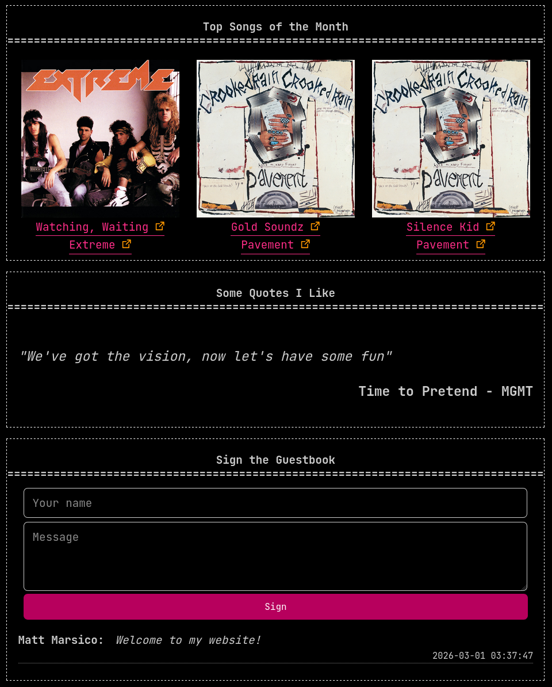

# Matt's Cloudflare Kit
Deploy these independent workers to easily add dynamic functionality to your static website.

## Documentation
Check out the docs at [mattmars3.github.io/matts-cloudflare-kit](https://mattmars3.github.io/matts-cloudflare-kit/)

## Current Widgets
Top Tracks API - pulls your top tracks from the Spotify API.

Quotes API - manage your favorite lyrics, quotes, or adages and display them on your website.

Guestbook - see who has visited your site and leave a message.

## Planned Widgets
Lyrics Comments - use Genius to link top tracks to their lyrics or integrate with the quotes API

Comment Section - create an interactive comment section for your static site.

Chalkboard - realtime community drawing board on your website

Chatroom - like a comment section but realtime

Picture Carousel - display some of your favorite pictures in an interactive carousel component

Message in a Bottle - Read and Write a Message to a Stranger

Live Polls & Graphs - interact with your audience about a specific topic

Rose-tinted glasses - apply a filter to the entire website view

## Screenshots

